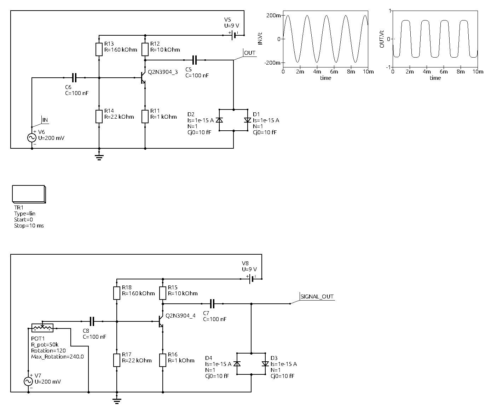
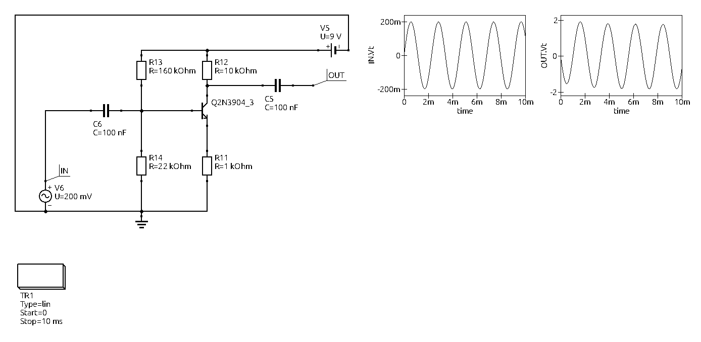

# Falcon — Analog Guitar Fuzz Effect

This repository contains documentation for the "Falcon" analog guitar fuzz/distortion effect: schematics, signal plots, and a short explanation of how the circuit works.

## Contents
- Schematics and signal plots: `falcon_schematics.png` (two circuit variants and input/output waveforms at maximum gain)
- Amplifier schematic and plots: `amplifier_plots.png`

## Overview

Falcon is an analog fuzz/distortion pedal for electric guitar. In `falcon_schematics.png` you can see two variants of the circuit: the top variant has no gain potentiometer (fixed, maximum gain), while the lower variant includes a potentiometer to adjust the amount of gain/distortion.

## Clipping section

Two diodes in the signal path perform clipping. At high gain the diodes conduct and clip the waveform peaks, producing the characteristic distorted tone. The variant without the gain potentiometer produces a stronger, more saturated clipping.

## Amplifier stage

The remainder of the circuit is a common-emitter amplifier. The amplifier schematic and its waveforms are shown in `amplifier_plots.png`.

## Waveforms

The plots in `falcon_schematics.png` show the input and output signals at maximum gain — demonstrating how the peaks are clipped and how the diode nonlinearity shapes the output waveform.

## Images

Below are the schematic images included in this repository.

### Falcon circuits and waveforms



### Amplifier schematic and plots



## Audio tests

The `assets/audio/` directory contains the audio test recordings used to demonstrate the effect:

- [RAW_SIGNAL_bass.mp3](assets/audio/RAW_SIGNAL_bass.mp3) — raw bass test signal
- [RAW_SIGNAL_guitar.mp3](assets/audio/RAW_SIGNAL_guitar.mp3) — raw guitar test signal
- [with_amp_Clean_settings.mp3](assets/audio/with_amp_Clean_settings.mp3) — signal after a clean amplifier stage

Playback: open the files with your preferred audio player or use `ffplay` / `mpv`, for example:

```
ffplay assets/audio/RAW_SIGNAL_guitar.mp3
```

Note: the audio files in this repository have been volume-adjusted for clearer listening demonstrations.

